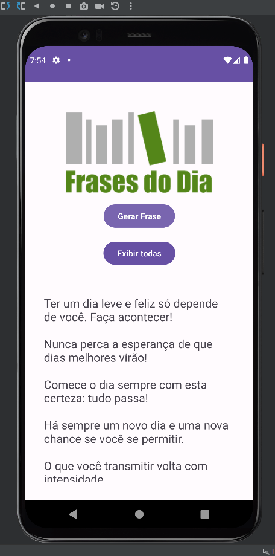

# Meu Primeiro applicativo android nativo com Java

O App tem a finalidade de sortear uma frase motivacional ou mostrar
todas as frases que ele possuí, é bem simples e eu quero evoluir 
a medida que eu for melhorando como desenvolvedor android nativo.

neste app a linguagem usada foi Java.

## Fabio Carneiro 11-2023

